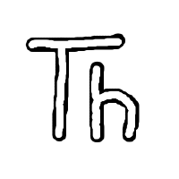

# Bienvenue !

Vous trouverez ci-après une courte formation sur la programmation en Python qui s'articule autour d'une application de résolution de Sudoku. Il vous faudra compter quelques heures de temps pour aller au bout de cet exercice.

## 1. Mais Python, c'est quoi ?
Si on se tourne vers [Wikipédia](https://wikipedia.org/), on trouve la définition suivante pour le [langage Python](https://fr.wikipedia.org/wiki/Python_(langage)) :

    Python (/ˈpaɪ.θɑn/6) est un langage de programmation interprété, multi-paradigme et multiplateformes. Il favorise la programmation
    impérative structurée, fonctionnelle et orientée objet. Il est doté d'un typage dynamique fort, d'une gestion automatique de la
    mémoire par ramasse-miettes et d'un système de gestion d'exceptions ; il est ainsi similaire à Perl, Ruby, Scheme, Smalltalk et Tcl.

    Le langage Python est placé sous une licence libre proche de la licence BSD et fonctionne sur la plupart des plates-formes
    informatiques, des smartphones aux ordinateurs centraux, de Windows à Unix avec notamment GNU/Linux en passant par macOS, ou encore
    Android, iOS, et peut aussi être traduit en Java ou .NET. Il est conçu pour optimiser la productivité des programmeurs en offrant
    des outils de haut niveau et une syntaxe simple à utiliser.

    Il est également apprécié par certains pédagogues qui y trouvent un langage où la syntaxe, clairement séparée des mécanismes de bas
    niveau, permet une initiation aisée aux concepts de base de la programmation.

Comme indiqué dans le dernier paragraphe, c'est aussi un langage utilisé dans l'enseignement de l'informatique des cursus français, un peu ce qu'était le LSE (_Language Symbolique d'Enseignement_ et non _Langage Simplifié pour Enseignant_ comme certaines mauvaises langues l'ont appelées) à son époque.

Parmis ces avantages notons que c'est un langage interprété, c'est à dire qu'il s'exécute directement en fournissant à un interpréteur de commandes, soit des commandes directes, soit un fichiers texte qui les regroupe. Ça facilite grandement la saisie d'un programme et son exécution ou son test.

C'est aussi un langage structuré, impératif et objet, c'est à dire qu'il s'exécute dans un ordre imposé par le programme en suivant des structures d'exécution comme des conditions ou des répétitions. On verra aussi qu'il est dit "objet" ce qui permet de regrouper les données et les fonctions qui s'y appliquent dans des classes. Au-delà de sa syntaxe, nous n'irons pas plus loin dans les spécificités des objets (polymorphisme par exemple).

## 2. Installation de l'IDE
L'IDE, c'est un outil de développement qui facilite l'édition et l'exécution du code Python. Il se trouve que l'IDE que je vous propose d'installer vient avec son interpréteur Python (presque la dernière version) ce qui vous simplifiera la tache d'installation.

J'ai choisi un IDE qui n'embarque pas de complexité, mais qui pourra être limité si vous souhaitez avoir une activité intense de développement... ça vous laisse une marge quand même !

Le produit choisi s'appelle [**Thonny** Python IDE for beginners](https://thonny.org/) qui s'installe automatiquement sur votre poste, incluant donc l'interpréteur Python, et vous permettant le développement dans un environnement fenêtré (pas en ligne de commande :-) ). Vous retrouvez le lien de téléchargement en haut à droite de la page web d'accueil : https://thonny.org/

Il vous suffira ensuite d'exécuter le fichier d'installation pour qu'il s'installe sur votre poste. Comme c'est un logiciel publié sous licence libre (License MIT), vous pouvez l'utiliser sans restriction ni paiement d'un droit d'utilisation. Il en va de même pour l'interpréteur Python associé bien qu'il soit placé sous une autre licence libre (la *PSF* (Python Software Foundation) *Licence Agreement*).

Une fois installé, vous devriez avoir une nouvelle icone disponible sur le « Bureau » ou dans votre menu de lancement.

Vous pouvez lancer l'IDE de Python.

## 3. Bonjour Monde !
