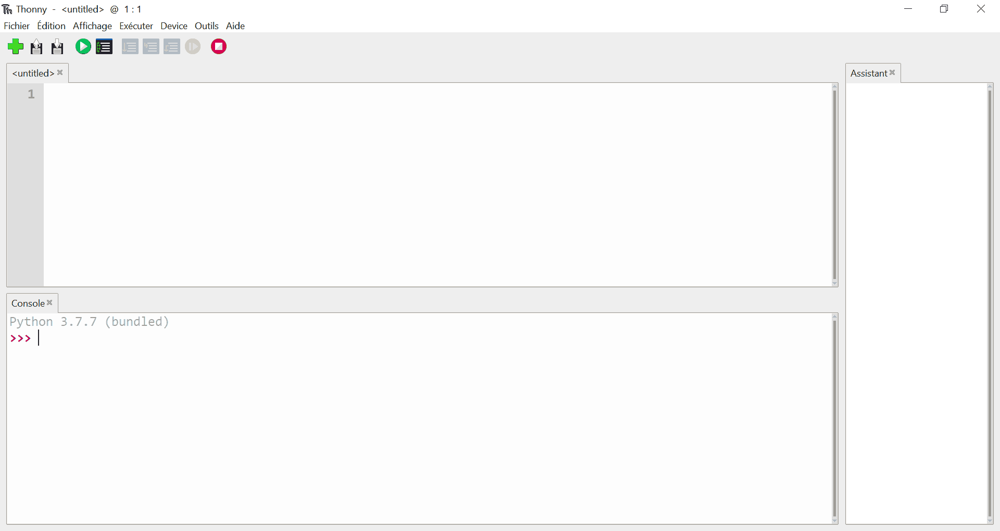

# Jour 1 : Le langage Python, l'IDE et la Classe (!)

---

- Retour au [Sommaire](index)

---

## 1. Mais Python, c'est quoi ?

Si on se tourne vers [Wikipédia](https://wikipedia.org/), on trouve la définition suivante pour le [langage Python](https://fr.wikipedia.org/wiki/Python_(langage)) :

> Python (/ˈpaɪ.θɑn/6) est un langage de programmation interprété, multi-paradigme et multiplateformes. Il favorise la programmation impérative structurée, fonctionnelle et orientée objet. Il est doté d'un typage dynamique fort, d'une gestion automatique de la mémoire par ramasse-miettes et d'un système de gestion d'exceptions ; il est ainsi similaire à Perl, Ruby, Scheme, Smalltalk et Tcl.
>
> Le langage Python est placé sous une licence libre proche de la licence BSD et fonctionne sur la plupart des plates-formes
    informatiques, des smartphones aux ordinateurs centraux, de Windows à Unix avec notamment GNU/Linux en passant par macOS, ou encore Android, iOS, et peut aussi être traduit en Java ou .NET. Il est conçu pour optimiser la productivité des programmeurs en offrant des outils de haut niveau et une syntaxe simple à utiliser.
>
> Il est également apprécié par certains pédagogues qui y trouvent un langage où la syntaxe, clairement séparée des mécanismes de bas niveau, permet une initiation aisée aux concepts de base de la programmation.

Comme indiqué dans le dernier paragraphe, c'est aussi un langage utilisé dans l'enseignement de l'informatique des cursus français, un peu ce qu'était le LSE (_Language Symbolique d'Enseignement_ et non _Langage Simplifié pour Enseignant_ comme certaines mauvaises langues l'ont appelées) à son époque.

Parmi ces avantages notons que c'est un langage interprété, c'est à dire qu'il s'exécute directement en fournissant à un interpréteur de commandes, soit des commandes directes, soit un fichier texte qui les regroupe. Ça facilite grandement la saisie d'un programme, son exécution ou son test.

C'est aussi un langage **structuré**, **impératif** et **objet**, c'est à dire qu'il s'exécute dans un ordre imposé par le programme en suivant des *structures* d'exécution comme des conditions ou des répétitions. On verra aussi qu'il est dit *objet* ce qui permet de regrouper les données et les fonctions qui s'y appliquent dans des classes. Au-delà de sa syntaxe, nous n'irons pas plus loin dans les spécificités des objets (polymorphisme par exemple).

## 2. Installation de l'IDE

L'IDE, c'est un outil de développement qui facilite l'édition et l'exécution du code Python. Il se trouve que l'IDE que je vous propose d'installer vient avec son interpréteur Python (presque la dernière version) ce qui vous simplifiera la tache d'installation.

J'ai choisi un IDE qui n'embarque pas de complexité, mais qui pourra être limité si vous souhaitez avoir une activité intense de développement... ça vous laisse une marge quand même !

Le produit choisi s'appelle [**Thonny** Python IDE for beginners](https://thonny.org/) qui s'installe automatiquement sur votre poste, incluant donc l'interpréteur Python, et vous permettant le développement dans un environnement fenêtré (pas en ligne de commande :-) ). Vous retrouvez le lien de téléchargement en haut à droite de la page web d'accueil : https://thonny.org/

Il vous suffira ensuite d'exécuter le fichier d'installation pour qu'il s'installe sur votre poste. Comme c'est un logiciel publié sous licence libre (License MIT), vous pouvez l'utiliser sans restriction ni paiement d'un droit d'utilisation. Il en va de même pour l'interpréteur Python associé bien qu'il soit placé sous une autre licence libre (la *PSF* (Python Software Foundation) *Licence Agreement*).

Une fois installé, vous devriez avoir une nouvelle icone disponible sur le « Bureau » ou dans votre menu de lancement.

Vous pouvez lancer l'IDE de Python :

## 3. Bonjour Monde !

Notre première commande, un grand classique de la programmation, est de faire afficher une chaine de caractère.

Dans la console, tapons la séquence `print("Hello World")`.

Vous verrez apparaitre :


Python 3.7.7 (bundled)
>>> print("Hello World")
Hello World
>>>


Voilà, il s'agit de l'exécution d'une commande en mode _interactif_.

Maintenant, allez dans la fenêtre qui s'appelle encore `<untitled>` pour y placer la même commande `print("Hello World")`.

Ensuite allez dans le menu `Fichier` et choisissez `Enregistrer`, ou encore utilisez le raccourcis `Ctrl+S`. Une fenetre va s'ouvrir pour permettre de sauvegarder votre fichier, vous pouvez l'appeler `exercice1.py` et valider.

Vous pouvez maintenant lancer le programme avec le bouton `Exécuter`. 

### La Classe

Lancer un nouveau programme (`Fichier` > `Nouveau` ou `Ctrl+N`), puis recopiez ou juste copier/coller le code ci-dessous dans la fenêtre que vous enregistrerez sous le nom `exercice2.py` :


"""Exercice 2a"""

class Application:
    """Ceci est notre classe Application"""

    def run(self) -> None:
        """Cette méthode imprime "Bonjour Monde" en anglais."""
        print("Hello World")

app = Application()
app.run()


Il s'agit d'une application en programmation objet (la **classe** `Application` et son **instance** `app`) qui réalise la même chose que précédemment.

> Les textes compris entre les triples apostrophes """ sont des commentaires.

### Les Méthodes

Dans notre **classe** `Application`, on définit la **méthode** `run()`. Cette méthode attend un paramètre unique qui est l'instance de la classe à laquelle elle appartient (`self`). Cette méthode ne retourne pas de résultat (`-> None`) ; elle imprime un message dans la console.

Ensuite, on crée une **instance** `app` de la classe `Application`, puis nous **invoquons** la méthode `run()`.

### Le Constructeur

Pour chaque classe, il existe une méthode spécifique qui est exécutée automatiquement à l'initialisation de chaque instance. Il s'agit du **constructeur** ; il se définit sous la forme d'une méthode ayant un nom réservé :


def __init__(self, chaine) :
	self._nom = chaine

	pass()


Dans l'exemple précédent, le constructeur accepte un paramètre qui permet d'initialiser l'attribut `_nom`. Avec son *tiret bas*, cet attribut est en plus **privé** ce qui interdit son utilisation en dehors de l'instance (il ne s'agit que d'une convention puisque Python n'interdit en fait rien).

#### Les Attributs

Cette méthode est appelée sur l'instance nouvellement créée et permet d'initialiser les **attributs** de cette instance. Ces attributs sont des variables associées à cette instance ou parfois à la classe (attributs de classe). Dans ce dernier cas, ces attributs sont _partagés_ entre toutes les instances de la même classe.

Les attributs initialisés après la déclaration de la classe... sont des attributs de classe, alors que les attributs définis dans le **constructeur** sont des attributs d'instance.

Mettons à jour l'exercice 2 :


"""Exercice 2b"""

class Application:
    """Ceci est notre classe Application"""

    def __init__(self, chaine) -> None:
        self._nom = chaine

    def run(self) -> None:
        """Cette méthode imprime "Bonjour " + nom + "!" en anglais."""
        print("Hello " + self._nom + "!")

app = Application("Le Maître du Monde")
app.run()


Pour aller plus loin dans les classes, je vous invite à consulter la documentation en ligne de Python : [https://docs.python.org/fr/3/tutorial/classes.html](https://docs.python.org/fr/3/tutorial/classes.html).

---

- Jour 2 : [Premier objet - Tout est dans la matrice](jour%202)

---
